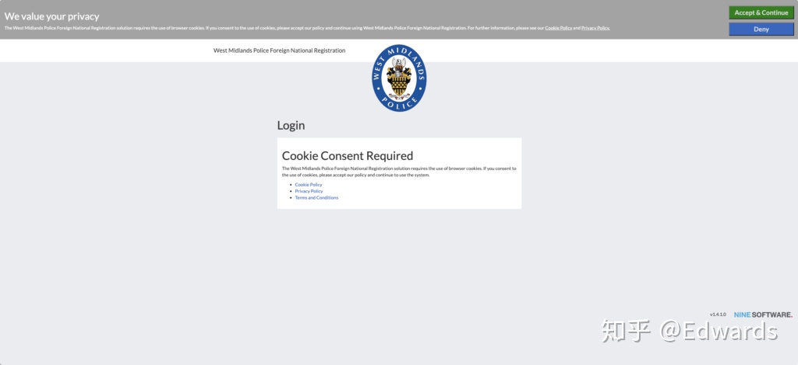
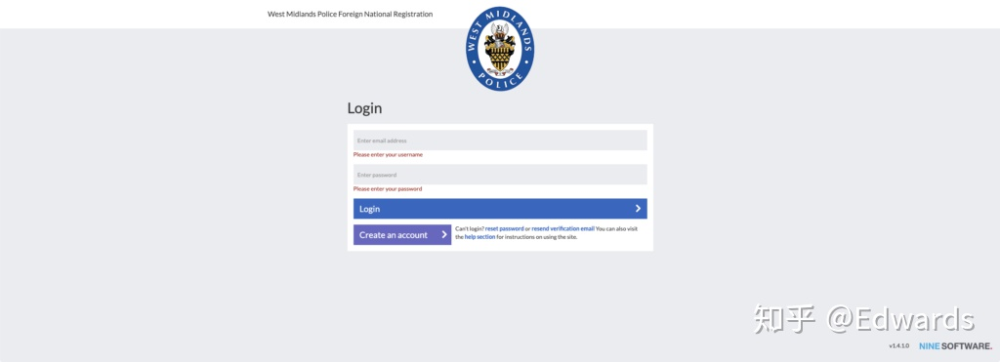
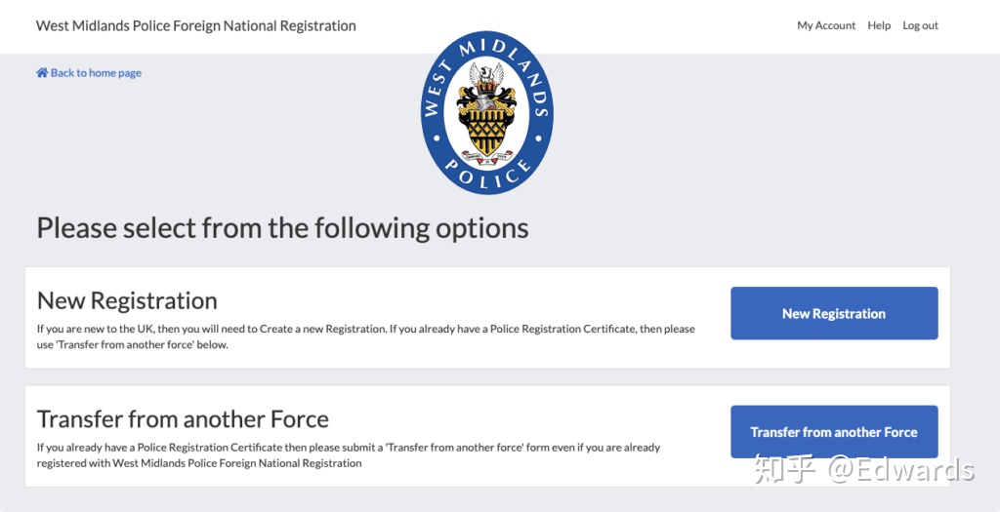
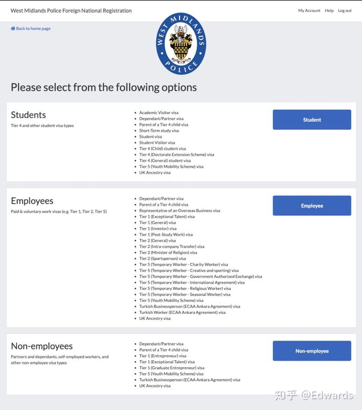
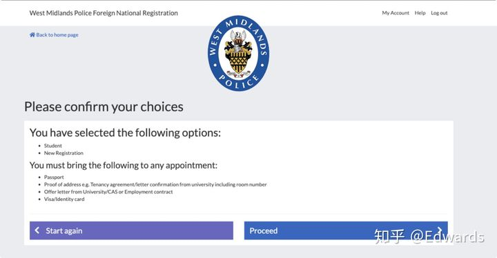
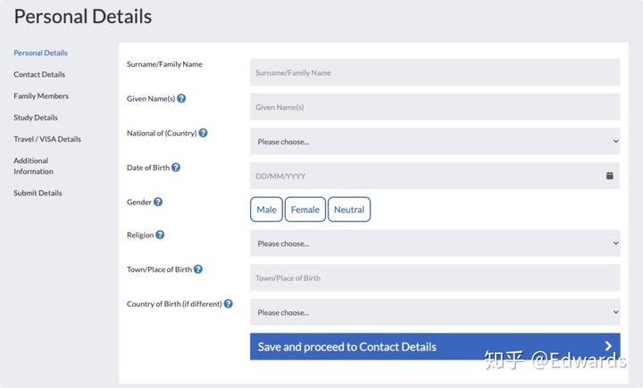
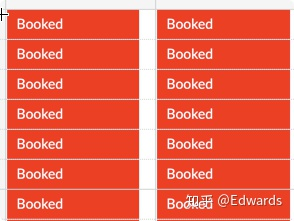

# 英国警局注册

::: tip 提示
本文[原帖](https://zhuanlan.zhihu.com/p/317481517)发布在知乎，作者：[爱德华兹](https://www.zhihu.com/people/edwards-80)
:::

[[toc]]

## 准备工作

* 护照
* BRP / 护照签证
* 学校证明 / 雇员证明
* 34 英镑（目前大部分警局在疫情期间只接受银行卡付款，且大部分警局不接受（即不可以）使用纯银联卡支付，可以使用双币卡）
* 地址证明：（三选一即可）
  * Bank Statement， 需要在英国有银行卡（是英国银行卡，不是中国银行卡），且英国银行卡使用日期超三个月，并三个月内未更改英国居住地址。
  * 学校开出的 Letter
  * 水电缴费单，也是需要三个月以上（不可以使用租房合同，警局不会接受）

## 具体警局注册操作

::: tip
这里以**伯明翰**为例，其他警局的操作系统基本一致
:::

1. 访问警局注册网站[https://west-midlands.overseasregistrations.uk/](https://west-midlands.overseasregistrations.uk/)，选择 Accept & Continue 。（否则无法进行下一步）

2. 注册或者登陆账户。

3. 注册会收到一封确认邮件，点击邮件中链接验证

4. 确认后，即可登陆

5. 如果你以前在英国注册过，那么选择 Transfer From Another Force，其他请选择 New Registration

6. 选择你在英国的身份

7. 确认以上内容已经完成，再看下面的内容

8. 选择 Proceed

9. 填写所有个人信息，正确填写，请多次确认信息填写无误

10. 正确填写后，即可 Submit

11. 接下来会收到确认邮件，并要求预约警局时间

12. 需要注意的是，这一步完成后，收到邮件已经证明你成功登记了警局注册，不再受 7 天内 警局注册限制，你接下来需要预约时间到警局登记，时间比较难约，不需要着急，只需要在你签证过期前去登记即可，但是不可以不去登记，这会影响你在英国的生活，乃至以后入境英国都有困难。只要你看到有时间可以预约，请预定位置，提前10分钟到达即可。

13. 预约界面，如果显示 Booked ，证明无法预约

14. 预约界面，如果显示 白色 ，证明无法预约，暂时未放出位置，可以多加留意

15. 预约界面，如果显示 灰色 ，证明无法预约，非工作时段

16. 预约界面，如果显示 Available ，证明可以预约

## 常见问题

1. 警局注册的时间（完成填表）是在入境的 7 天内。警局注册的时间（线下登记）是在 BRP 的有效期内。
2. 签证的上面日期只是规定了入境的时间范围，需要在有效期内入境，但是留英有效期请查看 BRP
3. 如果以前在其他警局注册过，需要带往年注册的确认书，带了就不用交 34 英镑，但是不见了，后果可能很严重
4. 如果以前在其他警局注册过，但是还是不小心选了下面步骤中 New Registration ，没关系，按照第三条讲的做就行
5. 我需要警局注册，但是我要隔离怎么办?  
先隔离，后拿 BRP ，再注册，不用担心时间限制
6. 我需要去警局注册吗?  
签证如果有需要你 Police Registration ，那你就需要在伯明翰警局注册  
请参考学校给出的信息: <http://url.iuob.uk/UoB-Police-Reg-Info>  
和  
伯明翰警察局给出的信息: <http://url.iuob.uk/Bham-Police-Reg-Info>
7. 伯明翰警局注册链接 <https://west-midlands.overseasregistrations.uk/>

