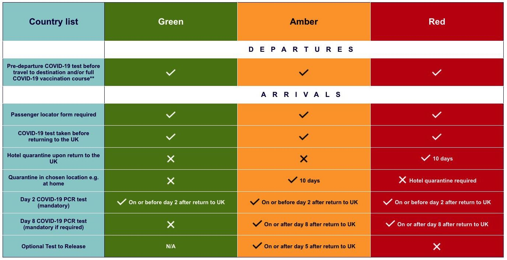

# 第二、第八天入境英国核酸检测包

[[toc]]

## 这是什么？

**入境核酸检测包**，指**核酸自我采样包**（不包括自测功能），检测包提供商将会分别在指定时间提前将核酸检测包邮寄至住址，以供第二天和第八天的自我核酸采样，采样完成后需在规定时间内邮寄至指定诊所实验室完成实验室核酸测试。

## 为什么需要？

根据英国政府对入境人员的[要求](https://www.gov.uk/find-travel-test-provider)，所有入境者（除红色名单外）需在入境前于获得资质的核酸检测提供商订购第二和第八天核酸检测采样包。

## 提供商推荐

### 王药师大药房（Optipharm Pharmacy）

* 订购网址：[点此访问](https://optipharmpharmacy.co.uk/collections/homepage-products/products/wsf)
* 价格：£159 (包含 2 次自我采样检测包)
* 优惠：下单时使用优惠代码“**UOB**”可立减 £10 （优惠代码不区分大小写）
* 优势：
    * 全英唯一一家华人 NHS 药房，提供全中文服务
    * **中国驻英国大使馆**认可的回国核酸检测服务机构（全英共 14 间）
    * 提供中文说明书
    * 合作快递为 DPD ，可随时查看投递状态
    * 有实体诊所
    * 全英连锁
* 劣势：
    * 不提供 Day 2 Only 检测包

### Midland Health

* 订购网址：[点此访问](https://midlandhealth.co.uk/covid-test-to-release-for-travel/)
* 价格：£179 (包含 2 次自我采样检测包)
* 优惠：无
* 优势：
    * 伯明翰最大的私人诊所
    * 有实体诊所
    * 全英连锁
* 劣势：
    * 只提供英文服务

## 其他常见问题

### 核酸检测包一定要购买吗？

根据英国政府要求，所有入境人员必须于指定的提供商处购买核酸检测包，否则拒绝入境。

### 如何订购？

大部分核酸检测包都有订购网站，访问网站，选择所需的服务，按照流程购买即可。

下单时请留意检测包提供商是否能提供邮寄方式的检测包寄送，部分提供商不提供邮寄方式的寄送，而部分提供商邮寄方式的寄送与在诊所内的检测价格相差较大。

### 如何查看我所在国家/地区是否处于英国的名单中？

请访问[英国政府官网](https://www.gov.uk/guidance/red-amber-and-green-list-rules-for-entering-england)查询

- 目前，中国（包括香港、澳门、台湾）均处于 Amber List （即，黄色名单）中，需要订购 Day 2 & Day 8 入境核酸检测包。

- 目前，澳大利亚、新西兰、新加坡均处于 Green List （即，绿色名单）中，仅需订购 Day 2 入境核酸检测包，或直接在机场完成检测。

### 入境时需要提供的资料

当旅行前在提供商预定成功后，您将收到一封包含的 Booking Reference 的邮件，您需要记录好此编号以供填写 Passenger Locator Form （即，入境旅客追踪表）。

### 伯明翰大学提供自我检测包，我还需要购买吗？

需要自行购买，自我检测包和自我采样包属于两个不同的产品。

- 前者（学校提供的自我检测包）：可以自我采样获得核酸检测结果，速度快，但没有经过实验室等严谨的检测流程，容错率较低
- 后者（自行购买的核酸检测包）：可以自我采样但是不提供自测，需要经过实验室等严谨的检测流程，且仅有此方式才能被英国政府认可

### 为什么检测机构提供的价格差别那么大？

价格可能由检测包的材料不同，检测实验室的环境、设备，人工等因素决定

还有一些机构提供便宜的检测包是需要自行去诊所检测的，而不是采取邮递的方式寄到你的居住地址

和购买机票一样，如果便宜的价格，就可能有一些风险（比如航班取消等），所以请记住“**一分钱一分货，便宜没好货，好货不便宜**”

### 我在隔离，怎么去取检测包和邮寄回实验室呢？

* 公寓**不允许**外出的话，准确填写收件地址，请提前和公寓工作人员说明，他们会在收到时亲自送到房间门口。采样完成后，按照说明书内容封装好，交由公寓工作人员代投递。
* 公寓**允许**外出的话，准确填写收件地址，等待收件。采样完成后，请自行前往附近的 Postbox 投递。（请点击[此处](https://www.royalmail.com/services-near-you)查找附近的 Postbox ）

### 邮寄物件遗失怎么办？

* 如果是因为收件地址填写错误而导致的检测包投递失败，需自行承担后果，请及时重新预定。
* 其他情况请及时联系核酸检测包提供商

### 我需要自己付邮寄出去的快递费吗？

不需要，价格中已经包含。邮寄出去统一由 Royal Mail 提供服务。

### 如果从绿色名单出发抵英

可直接选择各大机场提供的快速检测服务，即时出结果，结果为**阴性**后无需隔离

### 如果我从黄色名单国家出发，途径绿色国家，所以？

* 从黄色名单国家出发，途径绿色名单国家，根据政策算最低等级，即黄色名单政策，需要隔离 10 天 + 第 2&8 天核酸检测包
* 从黄色名单国家出发，途径红色名单国家，根据政策算最低等级，即红色名单政策，需要根据英国政府要求集中隔离
* 从绿色名单国家出发，途径黄色名单国家，根据政策算最低等级，即黄色名单政策，需要隔离 10 天 + 第 2&8 天核酸检测包
* 从绿色名单国家出发，途径红色名单国家，根据政策算最低等级，即红色名单政策，需要根据英国政府要求集中隔离
* 从红色名单国家出发，无论途径绿色还是黄色名单国家，都需要按照英国政府要求集中隔离

## 参考

### 名单比较 - Boots

