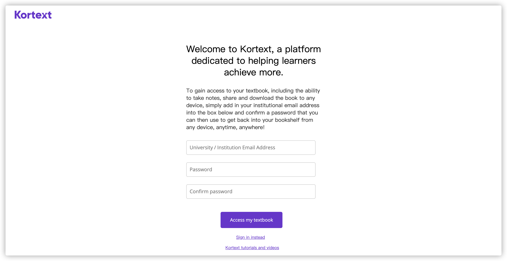
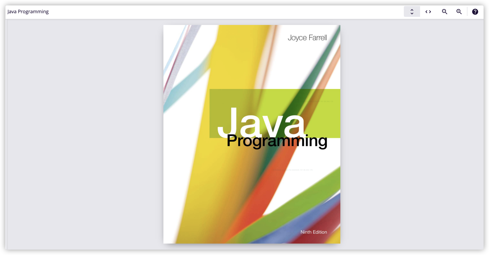

# 如何使用Kortext访问伯明翰大学相关课程电子课本 (eBook)？

---

以**Java Programming 9th Edition**为例

  1. 访问学校图书馆 [findit.bham.ac.uk](http://findit.bham.ac.uk/)

  2. 找到需要使用的书（这里以[https://birmingham-primo.hosted.exlibrisgroup.com/permalink/f/vmc2c6/44BIR_ALMA_DS51193255410004871](https://birmingham-primo.hosted.exlibrisgroup.com/permalink/f/vmc2c6/44BIR_ALMA_DS51193255410004871)为例）

  3. 找到 Kortext 链接，并点击

   
  
  4. 跳转至学校账户登陆界面

   
  
  5. 登陆学校账户

  
  6. 跳转至此界面（第一次认证时），输入学校邮箱及设置密码，后点击**Access my textbook**,如果你已经注册，请使用**Sign in instead**

   
  
  7. 登陆成功后，将跳转至阅读界面
  
   

现在可以使用Kortext手机软件或者电脑软件进行阅读
