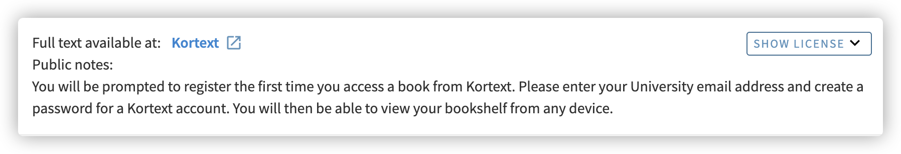

# How to access eBook via Kortext？（Eng Version）

---

Using **_Java Programming 9th Edition_** as an example

  1. Access UoB Library [findit.bham.ac.uk](http://findit.bham.ac.uk/)

  2. Find the book you want （Example as [https://birmingham-primo.hosted.exlibrisgroup.com/permalink/f/vmc2c6/44BIR_ALMA_DS51193255410004871](https://birmingham-primo.hosted.exlibrisgroup.com/permalink/f/vmc2c6/44BIR_ALMA_DS51193255410004871)）

  3. Find the link via Kortext, and click it

    
  
  4. Redirect to login page

    
  
  5. Login your UoB email address

  
  6. Redirect to Kortext (When the first time you access), type in student email and set a password, and click **_Access my textbook_**, if you already have a Kortext account, please use **_Sign in instead_** 

    
  
  7. After successful login, you will be redirected to the reading page
  
    

Now, You can use Kortext Mobile App or PC/MAC App to read the book
