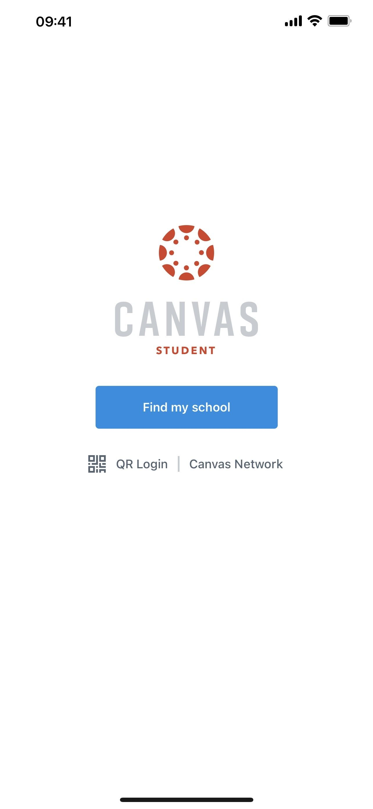
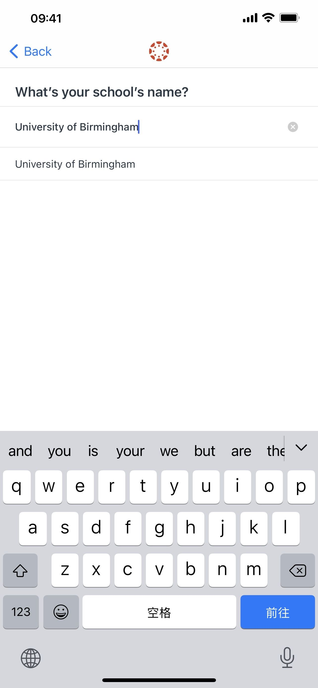
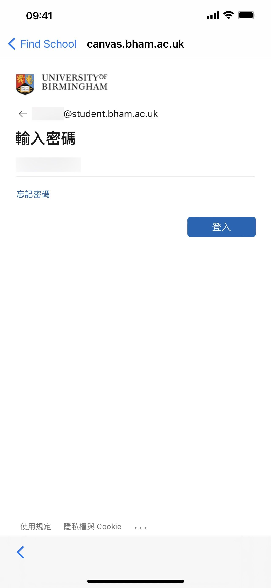
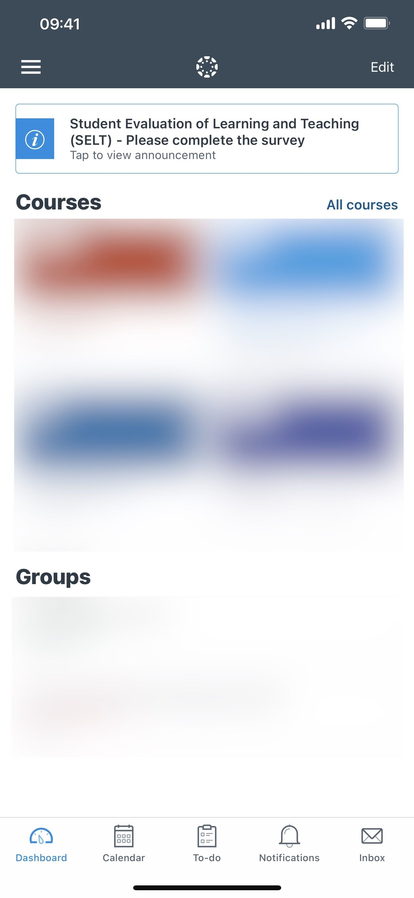

# 在 Canvas App 登陆学校账户

---

以下以 University of Birmingham 为例

1. 打开 Canvas App

2. 点击 Find my school

3. 输入 University of Birmingham

4. 点击下拉菜单中的 University of Birmingham, 跳转到新页面

5. 输入学校分配的邮箱

6. 点击下一步后, 输入密码

7. 点击下一步后, 成功登陆

