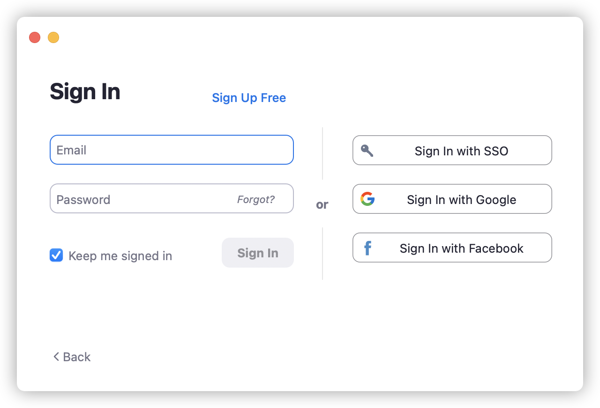
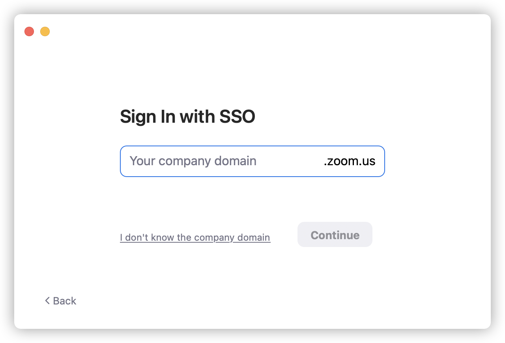
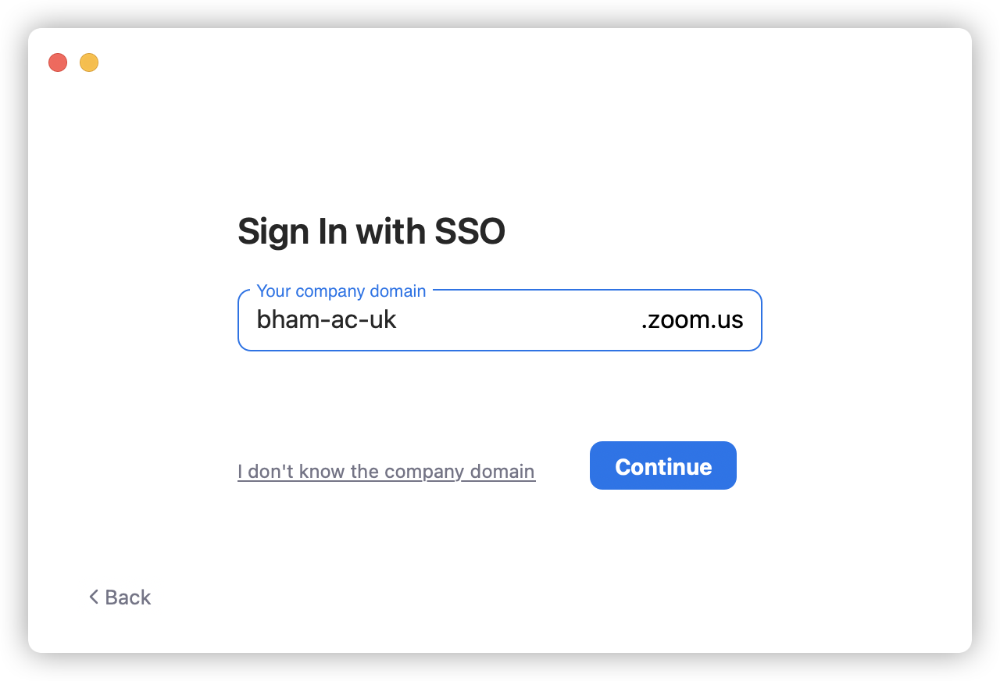
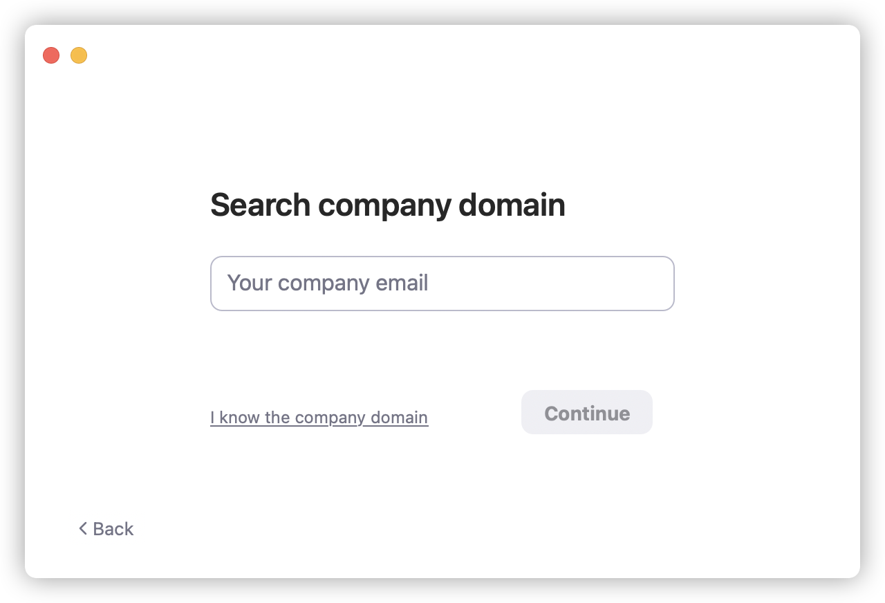
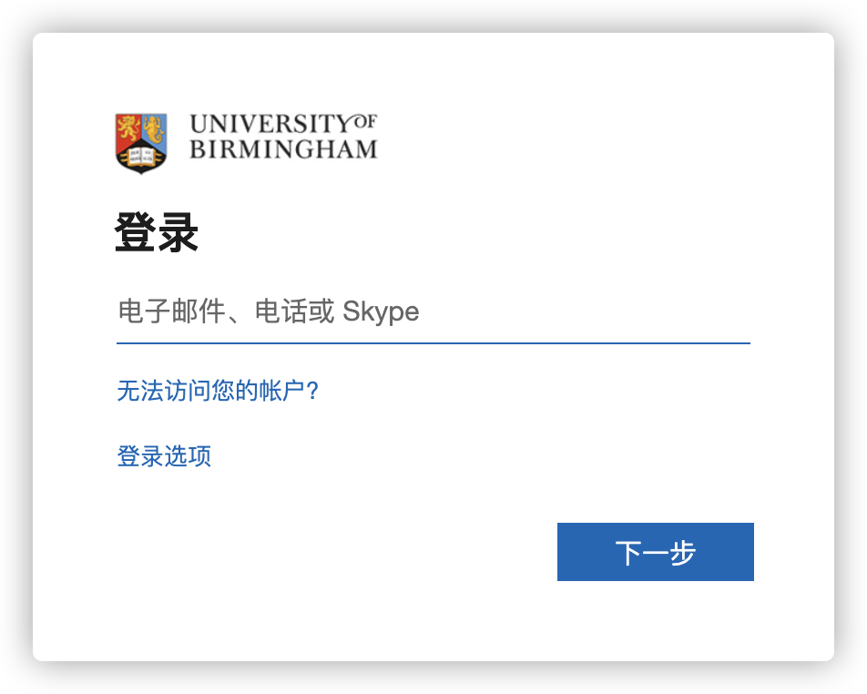
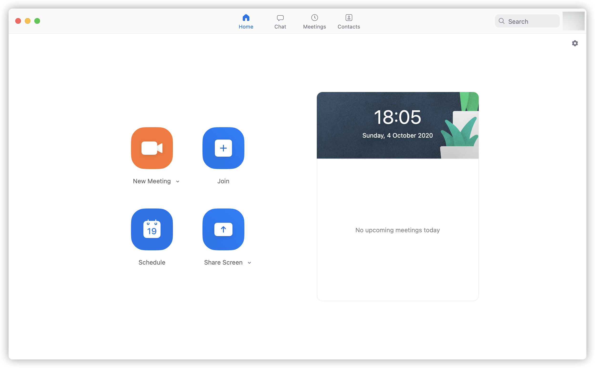

# 如何使用伯明翰大学 SSO 登陆 Zoom （简体中文）

---

以下以 University of Birmingham 为例

  1. 进入 Zoom 登陆界面
   
   
  
  2. 选择 SSO 登录
   
   
  
  3. 输入 SSO 域名，并点按继续
   
   
  
  4. 如果你不知道 SSO 域名，请使用邮箱进行查找

   
  
  5. 跳转至 SSO 认证界面
     
   

  6. 登陆成功即可访问 [Zoom.us](https://zoom.us) 账户
   
   