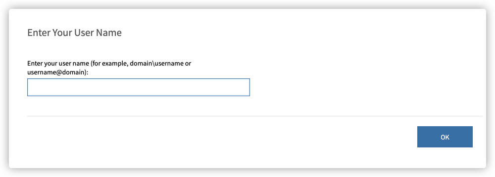
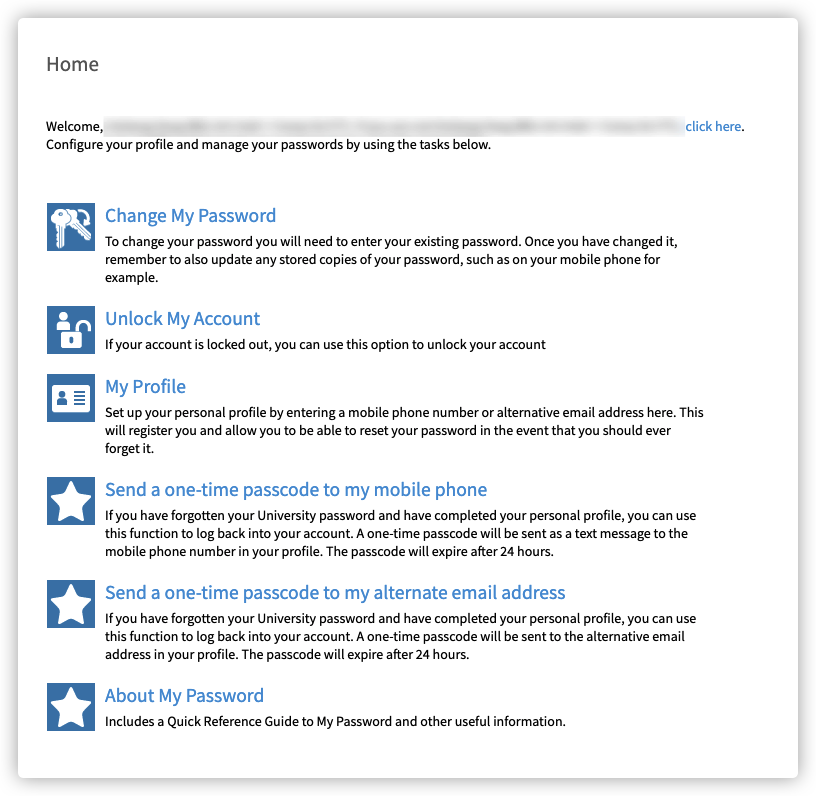
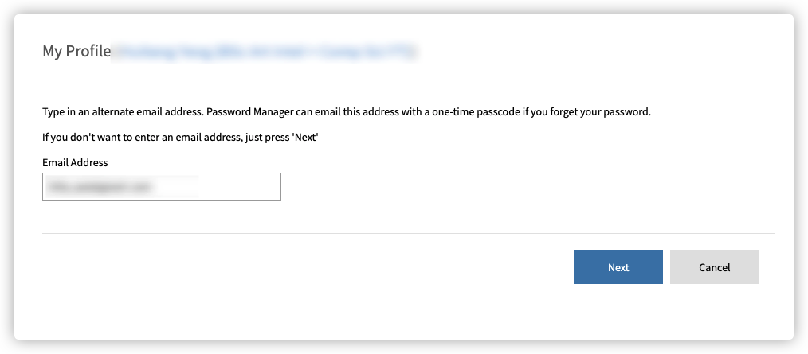
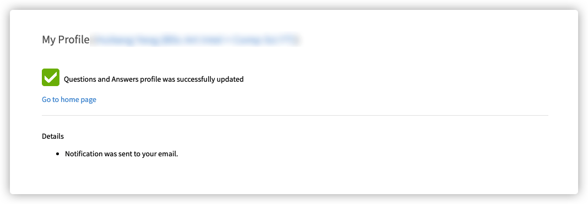
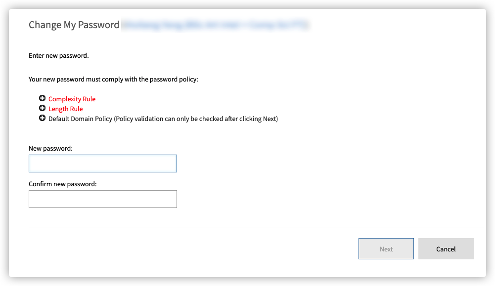

# 伯明翰大学学生账户密码修改

::: warning
请在阅读以下教程前，检查以下内容

1. 请确保你已经收到了学校下发的 Unconditional Offer
2. 请确保你已经收到了学校发送的注册邮件（点[此](https://cdn.iuob.uk/help/details/enrolled/account/UoB-Student-Registration-Email-Template.png)查看模版）

如果你未达到以上内容的任意一条，则暂不需要阅读此文
:::

[[toc]]

## 注册步骤

1. 访问[修改密码网站](https://my.password.bham.ac.uk/)

2. 输入用户名，OK （即，邮件中的 “学生账号用户名“ ，默认为字母加数字的形式，例如 **abc123** ）

3. 进入以下页面，点击 My Profile

4. 输入默认密码，然后 Next

5. 再按 Next ，跳过手机绑定页面

6. 进入邮箱绑定页面，输入**私人邮箱**，然后 Next

7. 看到绑定成功提示则为成功绑定

8. 回到主页，点击 Change My Password 

9. 输入默认密码，然后 Next

10. 进入密码更改页面，输入符合规则的密码

::: tip 密码规则
* 复杂性规则 
  * 密码必须满足系统复杂度要求： 
    * **不**包含用户帐户名的全部或部分 
    * 包含来自以下四个类别中的三个类别的字符： 
      * 英文大写字符（A 到 Z） 
      * 英文小写字符（a 到 z） 
      * 数字（0 到 9） 
      * 非字母字符（如 !、$、#、%） 
* 长度规则 
  * 密码必须满足系统的密码长度要求。密码长度 >= 8 
* 默认域策略
  * 密码不能与数据库的历史密码相同。数据库历史密码个数 = 10
:::

11. 符合要求后更改密码，看到成功提示则为成功修改密码

## 常见问题

### 注册邮件的 Subject 是什么？

Please Register with the University of Birmingham