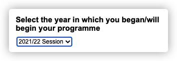
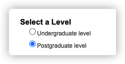
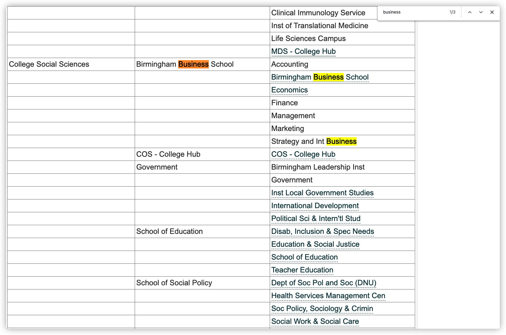
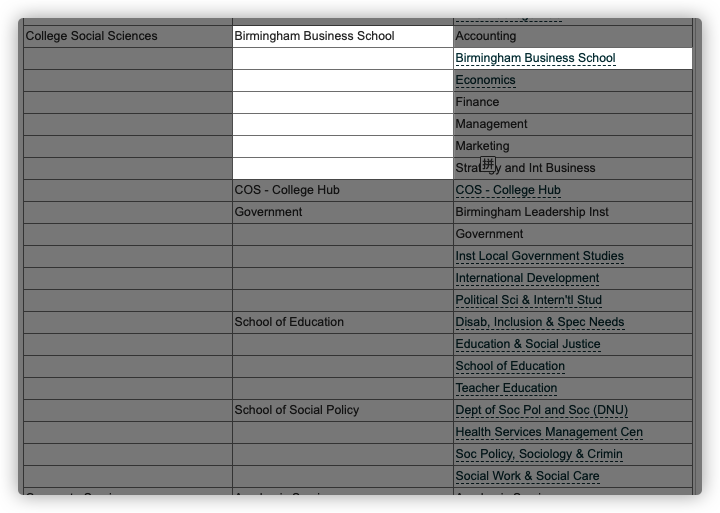
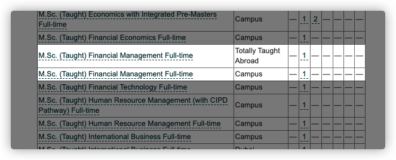
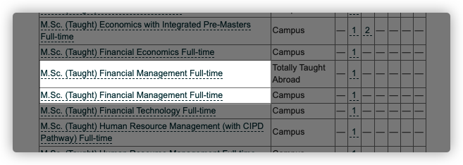
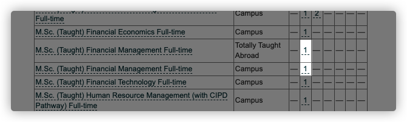
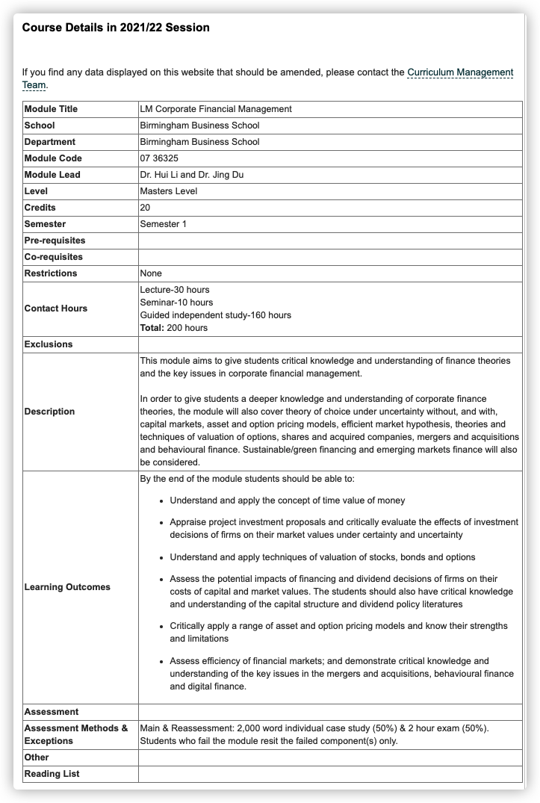

# 如何查找自己专业所属学院以及课程详情

---

::: tip 提示
以下以 2021/2022年度

**埃德巴斯顿校区 - 商学院 - 全日制 - 研究生 - 财务管理专业**

**Edgbaston - Postgraduate - Business Business School - M.Sc. (Taught) Financial Management Full-time**

为例
:::

1. 访问[iUoB伯明翰大学常用校园内部网站综合页面](../../../commonly-used-internal-websites/)
2. 找到**Programmes & Modules (所有学院课程手册)** ,或直接访问[此网站](https://program-and-modules-handbook.bham.ac.uk/webhandbooks/WebHandbooks-control-servlet?Action=getSchoolList&pgLevel=UG&rgTerm=002021)
3. 选择你所入读的年度(以**2021/22年度**为例)
   
4. 选择你所入读的课程(以**研究生**为例)
   
5. 下滑找到你所入读的学院(College)(以**College Social Sciences**为例)
    ::: warning 请注意
    如果你不知道你所入读的学院,请使用搜索功能(Mac: ⌘+F, Windows: Ctrl+F)直接搜索你的学院名称
    :::
   
6. 在学院列找到具体的School和Department(以**Birmingham Business School**为例)
   
7. 点击相关链接进入详情页面
8. 下滑找到你所入读的专业(以**M.Sc. (Taught) Financial Management Full-time**为例)
   
9.  找到入读的地点(以**Campus**为例)
10. 如果你想了解专业的具体信息,请点击专业名称
11. 如果你想了解专业课程的具体内容,请点击后面的数字(数字1代表Year 1, 以此类推)
    
12. 点击后面的数字将跳转至课程页面
    
13. Semester代表着学期,上图代表着第一学期有3节课程,而第二学期则有2(必修)+2(4选2)节课程
    ::: warning 请注意
    这里并不代表你一个星期只有3节课,具体的课程安排请及时查看邮件,以防错漏任何重要信息
    
    选修课程将会在学期开始前要求学生进行选择,如果没有及时选择,学校将会随机分配
    :::
14. 点击相关课程查看具体信息(以**LM Corporate Financial Management**为例)
    
15. 上图包含了所有需要了解的具体信息包括考试方法等, 请自行研究