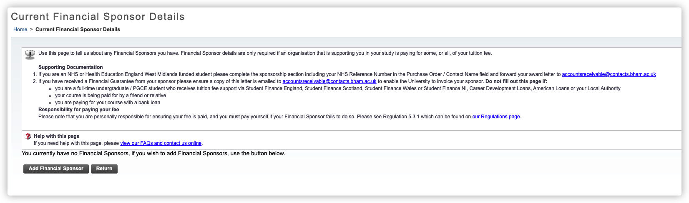

# 伯明翰大学学生注册

::: warning
请在阅读以下教程前，检查以下内容

1. 请确保你已经收到了学校下发的 Unconditional Offer
2. 请确保你已经收到了学校发送的注册邮件（点[此](https://cdn.iuob.uk/help/details/enrolled/account/UoB-Student-Registration-Email-Template.png)查看模版）
3. 请确保你已经修改了默认密码（点[此](./../Change-Default-Password/)查看如何修改默认密码）

如果你未达到以上内容的任意一条，则暂不需要阅读此文
:::

[[toc]]

## 注册步骤

### 登入注册网站

1. 访问[学生在线注册网站](https://registration.bham.ac.uk/)

2. 输入用户名（例，abc123）和密码，然后 Sign In

3. 进入主页面

### 1. Personal Details

::: warning
请参考以下图片并结合自身条件填写，填写完成后，请点击 **Submit**

* Mobile Phone Number 的填写方式为 861380013800 或 4407111111111
:::

成功保存后，前面会有绿色的勾 

### 2. Address Details

::: warning
请参考以下图片并结合自身条件填写，填写完成后，请点击 **Submit**

* 你仅需要添加两个地址（ Home 和 Termtime）
* 不推荐使用 Post Code Finder 来查找英国住址，推荐手动填写所有住址信息
:::

1. 使用 Type of Address to Insert 选项框， 选择 Home ，点击 New Address ，并完成 Home Address 的添加

2. 使用 Type of Address to Insert 选项框， 选择 Termtime ，点击 New Address ，并完成 Termtime Address 的添加

成功保存后，前面会有绿色的勾 

### 3. Emergency Contact Details

::: warning
请参考以下图片并结合自身条件填写，填写完成后，请点击 **Submit**

* 你仅需要添加 1 个紧急联系人即可
* 请手动填写所有住址信息
:::

1. 点击 New Contact 以添加信息

成功保存后，前面会有绿色的勾 

### 4. Programme Details

::: warning
请参考以下图片并结合自身条件填写，填写完成后，请点击 **Submit**

* 不需要勾选 Qualified Teacher Status 后面的小方块
* 请检查核对个人信息
:::

成功保存后，前面会有绿色的勾 

### 5. Further Details and Data Sharing

::: warning
请参考以下图片并结合自身条件填写，填写完成后，请点击 **Submit**

* 如果你不知道是什么，就别填写/勾选
* What was your highest qualification on entry to your current programme?（您进入当前课程的最高学历是什么？）此选项只有一次选择的机会，选择后将不可更改
:::

成功保存后，前面会有绿色的勾 

### 6. ID Card Photo & Document Upload

::: warning
请参考以下图片并结合自身条件填写，填写完成后，请点击 **Submit**

* 上传你的照片，此照片将作为学生证照片
:::

成功保存后，前面会有绿色的勾 

### 7. Financial Sponsor Details

::: warning
请参考以下图片并结合自身条件填写，填写完成后，请点击 **Submit**

* 如果你不是由机构/政府等资助，点进去再 Return 即可
:::

成功保存后，前面会有绿色的勾 

### 8 & 9

::: warning
请参考以下图片并结合自身条件填写，填写完成后，请点击 **Submit**
:::

跳过

### 10. Authorisation Contact Details

::: warning
请参考以下图片并结合自身条件填写，填写完成后，请点击 **Submit**
:::

参考 [3. Emergency Contact Details](#_3-emergency-contact-details)

### 11. Declaration/Registration

::: warning
请参考以下图片并结合自身条件填写，填写完成后，请点击 **Submit**

* 请检查个人信息
* 请阅读所有内容后，勾选 I agree to the Declaration: 后的选项框
:::

成功保存后，前面会有绿色的勾 

### 12. Funding

::: warning
请参考以下图片并结合自身条件填写，填写完成后，请点击 **Submit**
:::

跳过

### 成功注册

::: tip
当你完成以上所有内容后，你将会收到注册成功邮件（点[此](https://cdn.iuob.uk/help/details/enrolled/account/UoB-Student-Successfully-Registration-Email-Template.png)查看模版）
:::

## 常见问题

### 注册邮件的 Subject 是什么？

Please Register with the University of Birmingham

### 注册成功邮件的 Subject 是什么？

Registration Confirmation for Academic Session 20XX/XX
